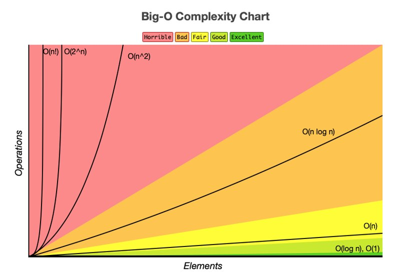

# Algorithm Analysis - EAM

## Academic Context

Analysis of Algorithms, Faculty of Sofware Engineering, EAM (2024-2).

**Professor:** Fernando Tovar Herrera.

## License

All content within this repository is licensed under the [MIT License](LICENSE). Feel free to use, modify, and distribute the materials.
