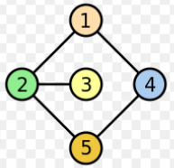

# Connected Graph

## Problem

Given the following connected graph.



Design:

1. **Adjacency matrix**
1. **Power matrices**
1. **Sum matrix**
1. **Paths for:**

   | Start Node | End Node | Path Length |
   | ---------- | -------- | ----------- |
   | 5          | 4        | 1           |
   | 2          | 2        | 2           |
   | 3          | 2        | 3           |
   | 3          | 5        | 4           |

## Solution

1. **Adjacency matrix**

   ```julia
   A
   ┌               ┐
   │ 0  1  0  1  0 │
   │ 1  0  1  0  1 │
   │ 0  1  0  0  0 │
   │ 1  0  0  0  1 │
   │ 0  1  0  1  0 │
   └               ┘
   ```

1. **Power matrices**

   ```julia
   A^2
   ┌               ┐
   │ 2  0  1  0  2 │
   │ 0  3  0  2  0 │
   │ 1  0  1  0  1 │
   │ 0  2  0  2  0 │
   │ 2  0  1  0  2 │
   └               ┘

   A^3
   ┌               ┐
   │ 0  5  0  4  0 │
   │ 5  0  3  0  5 │
   │ 0  3  0  2  0 │
   │ 4  0  2  0  4 │
   │ 0  5  0  4  0 │
   └               ┘

   A^4
   ┌                 ┐
   │ 9   0  5   0  9 │
   │ 0  13  0  10  0 │
   │ 5   0  3   0  5 │
   │ 0  10  0   8  0 │
   │ 9   0  5   0  9 │
   └                 ┘

   A^5
   ┌                    ┐
   │  0  23   0  18   0 │
   │ 23   0  13   0  23 │
   │  0  13   0  10   0 │
   │ 18   0  10   0  18 │
   │  0  23   0  18   0 │
   └                    ┘
   ```

1. **Sum matrix**

   ```julia
   S
   ┌                    ┐
   │ 11  29   6  23  11 │
   │ 29  16  17  12  29 │
   │  6  17   4  12   6 │
   │ 23  12  12  10  23 │
   │ 11  29   6  23  11 │
   └                    ┘
   ```

1. **Paths**

   | Start Node | End Node | Path Length | Total Paths | Paths                                                                                                                             |
   | ---------- | -------- | ----------- | ----------- | --------------------------------------------------------------------------------------------------------------------------------- |
   | 5          | 4        | 1           | 1           | 5 -> 4                                                                                                                            |
   | 2          | 2        | 2           | 3           | 2 -> 1 -> 2 <br> 2 -> 3 -> 2 <br> 2 -> 5 -> 2                                                                                     |
   | 3          | 2        | 3           | 3           | 3 -> 2 -> 1 -> 2 <br> 3 -> 2 -> 3 -> 2 <br> 3 -> 2 -> 5 -> 2                                                                      |
   | 3          | 5        | 4           | 5           | 3 -> 2 -> 3 -> 2 -> 5 <br> 3 -> 2 -> 5 -> 2 -> 5 <br> 3 -> 2 -> 1 -> 2 -> 5 <br> 3 -> 2 -> 5 -> 4 -> 5 <br> 3 -> 2 -> 1 -> 4 -> 5 |
